# TuneSort: Offical Documentation

## Github Repos
- [Client](https://github.com/shalforb/T3A2-tunesort/tree/ec3aa68b67ec0bd693d9cfde43c48529db3e648b/T3A2-B-tunesort-client)
- [Server](https://github.com/shalforb/T3A2-tunesort/tree/ec3aa68b67ec0bd693d9cfde43c48529db3e648b/T3A2-B-tunesort-server)

## Deployed Sites

- [Client](t3-a2-tunesort-client.vercel.app) - via Vercel
- [Server](https://t3a2-tunesort-server.onrender.com) - via Render

*Dev note: The server is currently deployed using a free Render instance, which spins down with inactivity. If creating account/logging in doesn't initialize, please wait a couple minutes for the server to start.* 

## Purpose
The purpose of this web application is to provide users with a powerful and intuitive tool to browse and explore a music library. By leveraging detailed song metadata, such as BPM, key, or energy, users can easily sort and filter through a vast collection of songs. This app aims to serve music enthusiasts, DJs, and music professionals who require a sophisticated way to discover and organize music based on specific musical attributes.

## Functionality / Features
- **User Authentication:** Users can create accounts, log in, and manage their profiles - as well as link their existing spotify accounts.
- **Music Library:** A comprehensive library of songs fetched from the Spotify API, including detailed metadata.
- **Search and Organize:** Users can search for songs and sort the library by BPM, key, and other attributes.
- **Song Details:** Detailed view of each song, displaying all available metadata (title, artist, album, BPM, key, etc.).
- **Playlists:** Users can create and manage playlists, adding songs from the library.

- **Responsive Design:** The app will be optimized for both desktop and mobile devices.
- **User Interface:** A clean, intuitive, and visually appealing interface designed for easy navigation.

## Target Audience
- **Music Enthusiasts:** Individuals who enjoy discovering and exploring music based on detailed attributes.
- **DJs:** Professional and amateur DJs looking for specific BPMs and keys to mix and match songs seamlessly.
- **Music Producers:** Producers who need to find songs that fit certain criteria for their projects.
- **Radio Stations:** Radio hosts and curators who need to organize and select songs for various shows and segments.
- **Music Educators:** Teachers and students looking for songs in specific keys or tempos for educational purposes.

## Tech Stack
### Frontend:
- **React:** For building the user interface and managing the application's state.
- **Tailwind** For styling the application and ensuring a responsive design.

### Backend:
- **Node.js:** For the server-side runtime environment.
- **Express:** For building the backend API and handling HTTP requests.

### Database:
- **MongoDB Compass:** For storing and testing the database locally.
- **MongoDB Atlas:** For storing, acessing and updating the databse via cloud.

### External APIs:
- **Spotify API:** For fetching song data and detailed metadata such as BPM and key.

### Authentication:
- **OAuth 2.0 (Spotify):** For authenticating users and accessing Spotify data.
- **JWT (JSON Web Tokens):** For managing user sessions securely.

### Deployment:
- **Frontend:** Hosted via Vercel
- **Backend:** Hosted on cloud platforms like Heroku, AWS, or DigitalOcean.
- **Database:** MongoDB Atlas for a scalable and managed database solution.

### Tools and Libraries:
- **Axios:** For making HTTP requests to the APIs.
- **Mongoose:** For interacting with MongoDB in a structured way.
- **Bcryptjs:** For hashing passwords. It helps in securely storing user passwords by hashing them before saving them to the database.
- **Jsonwebtoken (JWT):** For creating and verifying JSON Web Tokens. 
- **React-Icons:** A library that provides popular icon packs as React components, useful for enhancing the UI with icons.

## Dataflow Diagram

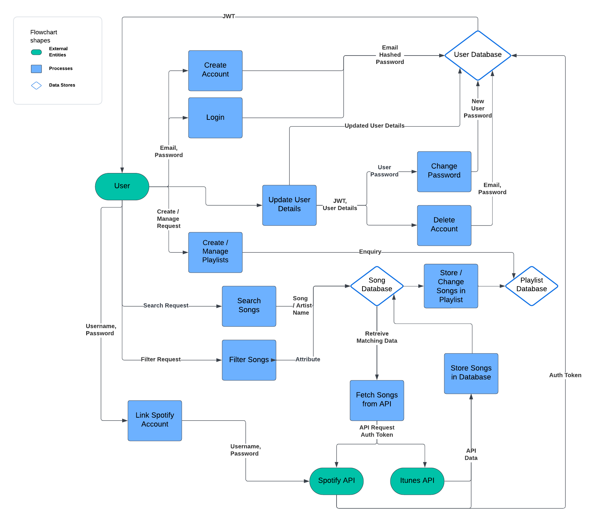

## Application Architecture

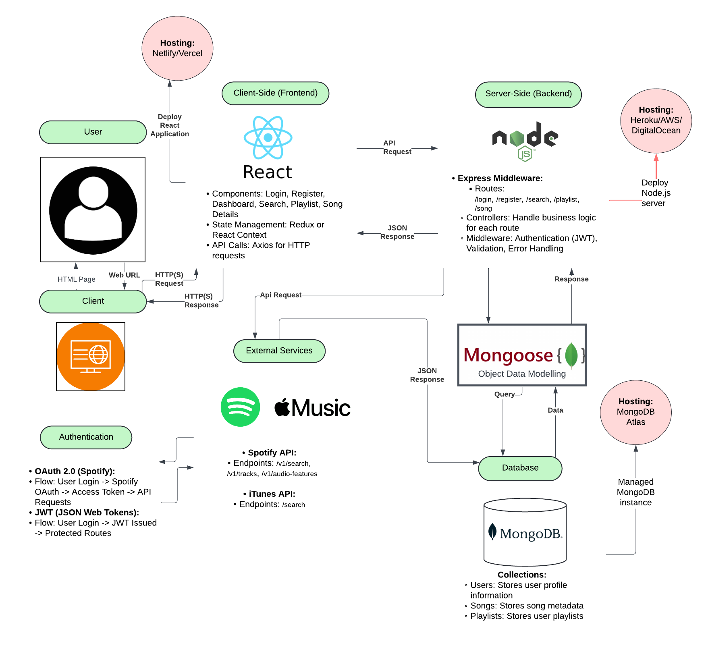

## User Stories

### 1. Spotify Linking and Login

- **Persona:** Music Enthusiast
- **What:** As a music enthusiast, I want to be able to link my existing spotify account.
- **Why:**  So that I can access and sort through playlists I have already made within the app.

**Refinement:** Initially, the story was focused only on login. It was refined to include spotify coupling to cover the full user onboarding process.

### 2. Search and Filter Songs

- **Persona:** DJ
- **What:** As a DJ, I want to search and filter songs by the camelot wheel.
- **Why:** The key of a song itself is not important to me, as a DJ, I want to be able to view only what camelot category the song is in as this more relevant to mixing.

**Refinement:** Originally, the story included only BPM and key. Based on user feedback, camelot filtering was added to enhance usability.

### 3. Create and Manage Playlists

- **Persona:** Music Producer
- **What:** As a music producer, I want to create and manage playlists.
- **Why:** So that I can organize songs for different projects and sessions.

**Refinement:** Initially focused on accessing playlists, it was expanded to include management (editing and deleting) of playlists within the app.

### 4. Fetch Detailed Song Information

- **Persona:** Music Educator
- **What:** As a music educator, I want to see detailed information about each song, including BPM, key, and genre.
- **Why:** So that I can use this information for teaching music theory and song analysis.

**Refinement:** Added additional metadata details (genre) to provide a more comprehensive educational tool.

## Evidence of User Story Revision and Refinement

### Initial User Story: User Registration and Login
- **Initial Version:** As a user, I want to log into the app.
- **Feedback:** Linking an existing Spotify account will streamline the app's usability.
- **Refinement:** Added the Spotify link feature.

### Initial User Story: Search Songs
- **Initial Version:** As a DJ, I want to search songs by Camelot.
- **Feedback:** Key is not relevant to DJ mixing.
- **Refinement:** Expanded to include camelot filtering.

### Initial User Story: Fetch Detailed Song information
- **Initial Version:** As a music educator, I want to see detailed information about each song.
- **Feedback:** More information about the songs can be utilised in a teaching scenario.
- **Refinement:** Expanded to include more metadata a user can access.

## Wireframes

### Desktop Wireframes

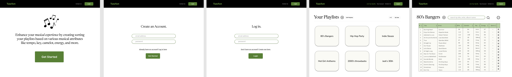

### Tablet Wireframes

### Mobile Wireframes

# Planning (Trello)

To initiate the project planning process, a Trello board was set up to streamline project tasks, track progress, and ensure alignment with the project's objectives. The board was divided into three main categories: To Do, Doing, and Done, providing a clear and concise overview of work progress at any given point.

Color-coding was used for each card to clearly distinguish between different aspects of the project. Labels were another key feature employed to add an extra layer of categorization within the color-coded cards. To maintain a smooth workflow and meet deadlines, due dates were set for each card. This not only helped prioritize tasks effectively but also ensured consistent progress toward project goals.

A unique checklist was created for each card, providing a detailed breakdown of the individual steps required to complete the task. As progress was made, completed items were ticked off, allowing for granular tracking and ensuring nothing was missed.

The use of Trello for this project was instrumental in maintaining organization, productivity, and alignment with project goals. It provided a visual snapshot of the project's status and facilitated efficient task management, leading to a streamlined and effective workflow.

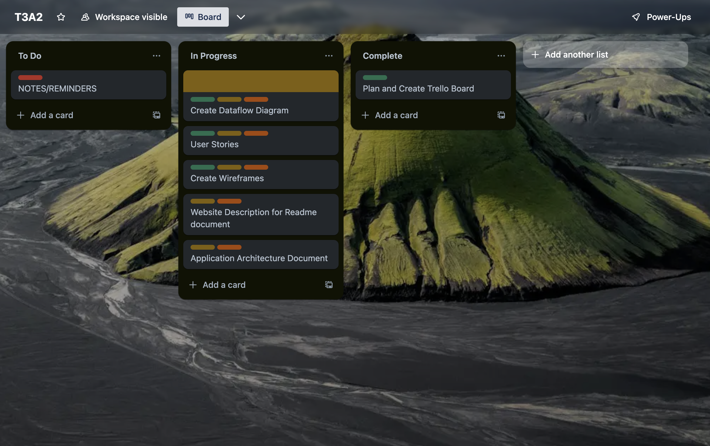

For Part B, initially planning was kept similar to how Part A was achieved - where individual tasks were isolated and logged in the In Progress list. Color-coding was again implemented, where backend related cards would be labled blue, and frontend would be labelled green.

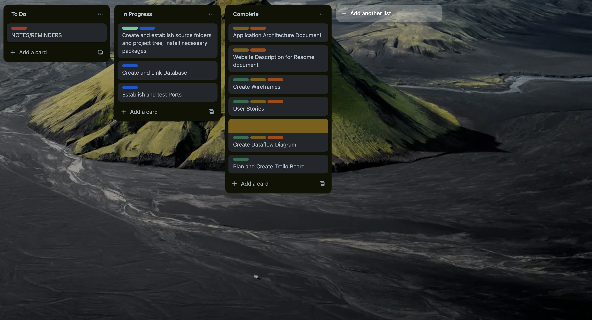

Individual details of the single task were found within the description of the card.

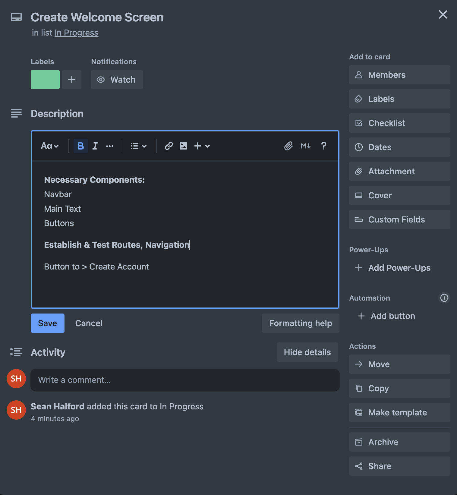

After working through the app for a while, it became easier to maintain planning by splitting tasks into larger categories, where within the larger categories - individual lists could be kept that could be broken off into single tasks that could be moved on into the In Progress list, whilst still maintaining a checklist of the broader scope to the right. It also became instrumental to keep track of any bugs or issues the app began to face.

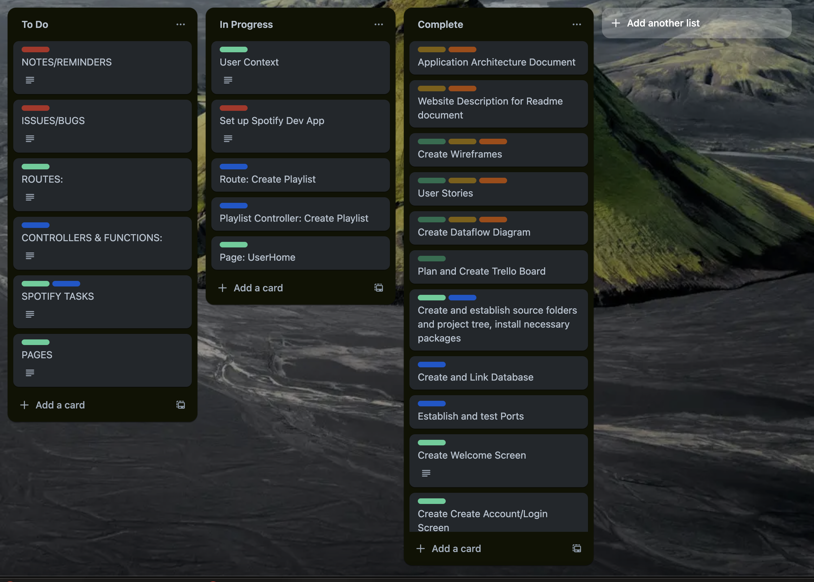

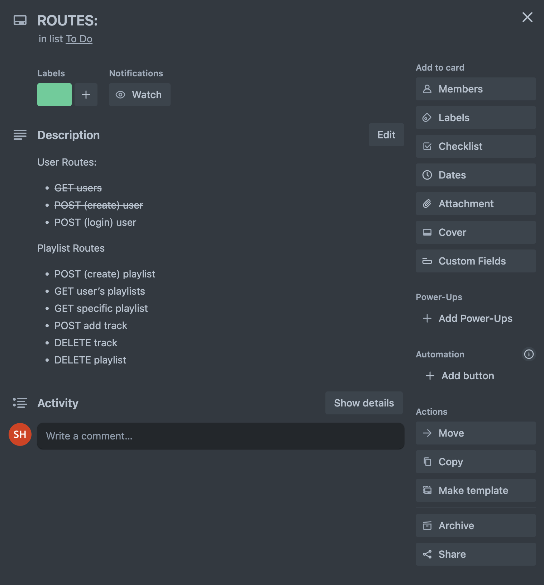

Testing and deployment became the final stages of planning, where it was broken down in a similar fashion. As the project neared the end, this was also an opportune time to introduce any ideas that may have been floating around of potential features, or front end clean-up that could be implemented if time allowed.

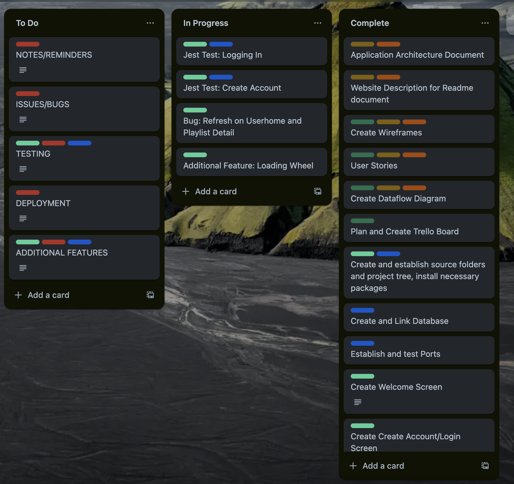

## Development & Production Testing

During the development of my Express and React application, thorough testing was a critical component to ensure robust functionality and seamless user experiences. I meticulously documented individual routes, workflows, and authentication flows in Trello, allowing for systematic tracking and identification of potential issues. To validate the functionality of each route, I employed Postman extensively, conducting rigorous tests to ensure that all API endpoints were functioning as expected. This included verifying that tokens were generated and managed correctly, authentication processes were secure and reliable, and that the database was accurately receiving, storing, and retrieving data.

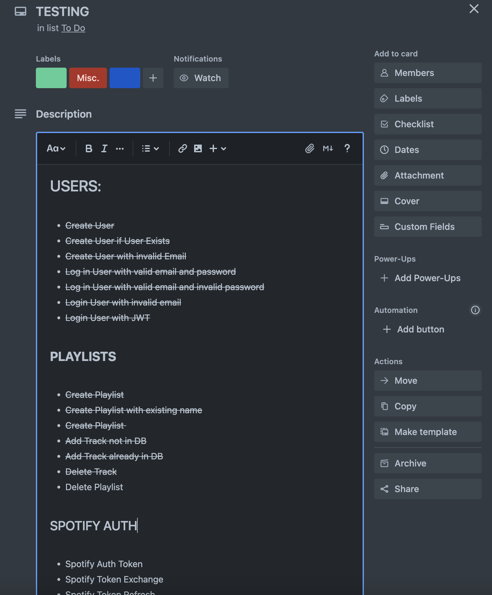
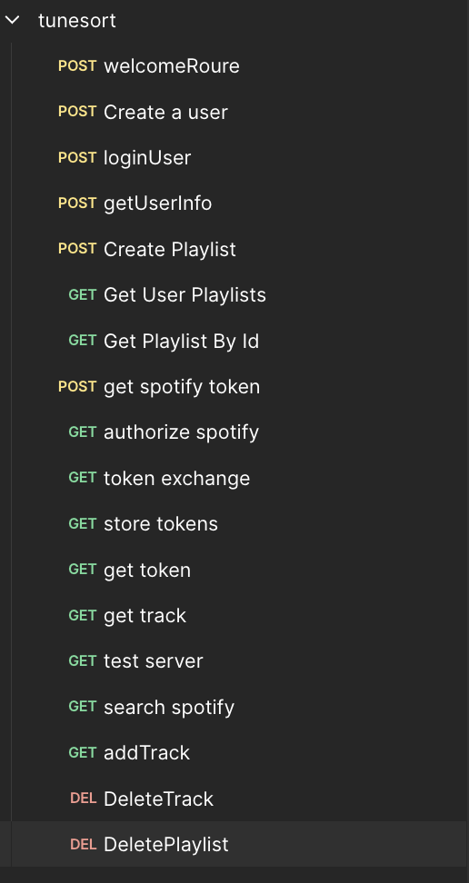
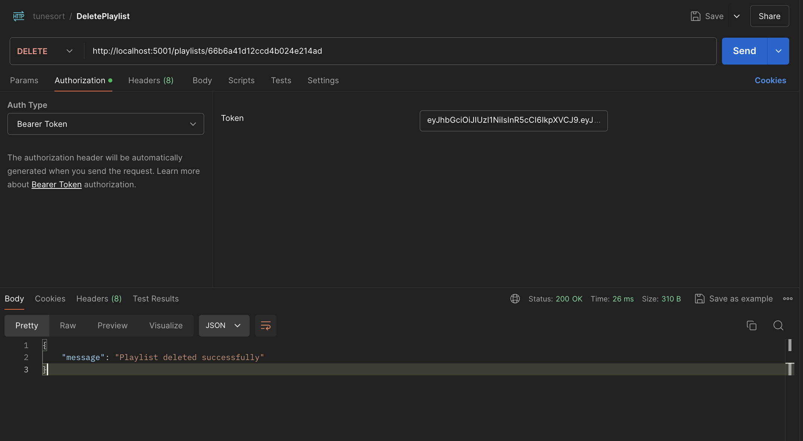

In addition to using Postman, I incorporated extensive console logging throughout the development process. This allowed me to observe real-time feedback on function execution, particularly when handling complex authentication flows and token exchanges, ensuring that everything worked correctly at each stage.

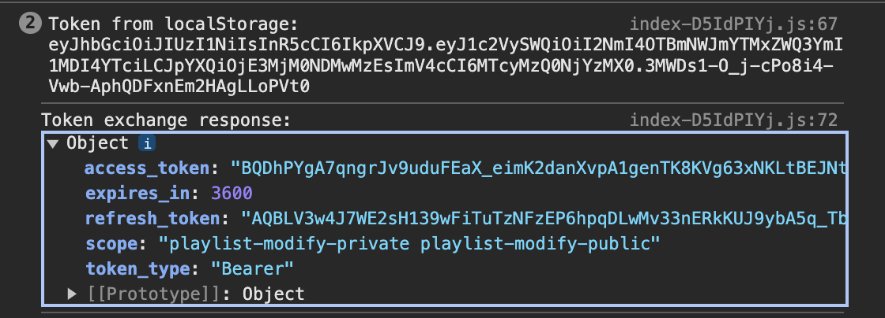

Moreover, I implemented Jest testing in both the client and server environments to automate and validate the functionality of my application components. On the server side, I wrote unit tests for controllers, such as createPlaylistController.test.js and createUserController.test.js, ensuring that the playlist creation and user registration processes worked correctly and handled all edge cases. On the client side, I developed tests for critical components, including CreateAccountForm.test.jsx and LoginForm.test.jsx, to verify that user interactions, form submissions, and data handling were correctly implemented.

By combining manual testing with Postman, thorough console logging, and automated testing using Jest, I ensured that my application was both robust and reliable, with all features performing as intended across various scenarios.

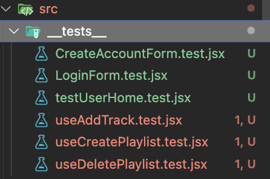
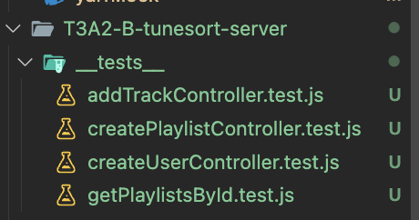